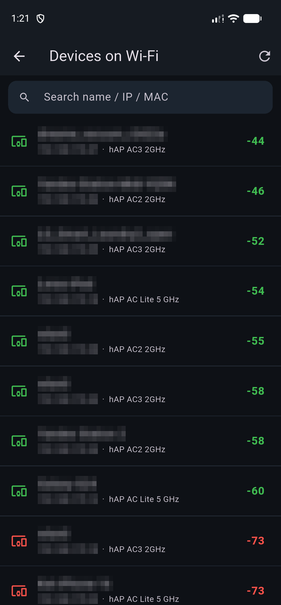

# MikroTik Wi-Fi Signal Tester

*Русская версия — [README.ru.md](README.ru.md)*

A Flutter app (Android plus an initial macOS target, iOS later) for **testing
Wi-Fi from both sides**.
Regular analyzers show only how your phone hears the access point. For real
site-survey work you also need to know **how the access point hears your
device** — signal, SNR, rates. This app reads that from a MikroTik (running
CAPsMAN or plain Wi-Fi) **read-only**, for **your device's MAC only**, and puts
it next to your phone's own readings.

The app also contains a **separate LTE diagnostics and antenna-alignment tool**
for MikroTik LTE routers. It reads modem radio quality over REST, the binary API
or SSH and does not depend on or mix with the Wi-Fi dashboard.

<table>
<tr>
<td width="33%"></td>
<td width="33%"></td>
<td width="33%"></td>
</tr>
<tr>
<td align="center"><b>Both sides at once</b><br/>the phone hears the AP at −48 dBm, the AP hears the phone at −45 dBm</td>
<td align="center"><b>Read-only audit</b><br/>Wi-Fi and system checks with plain-language fixes, exportable to PDF</td>
<td align="center"><b>Any device on Wi-Fi</b><br/>see how the APs hear a TV, laptop or a guest's phone</td>
</tr>
</table>

## Download

Grab the latest APK from the [Releases page](../../releases/latest) — download
`wifi-signal-tester-<version>.apk` under *Assets* and install it on your Android
device.

Every push/merge to `main` builds the APK, creates the `v<version>` tag from
`VERSION` and publishes a GitHub Release automatically. The same APK is also
available from that workflow run under [Actions](../../actions/workflows/release.yml)
→ *Artifacts*. Do not create release tags manually; bump the app version before
the merge instead.

## How to use it

**[docs/usage.md](docs/usage.md)** is the user guide: preparing the router,
connecting, reading the two sides and the Δ badge, running the audits, recording
a walk-around survey, targets and alerts, and a troubleshooting table. The same
guide is reachable in-app from ⋮ → *How to use* and from the Reference screen.

## Features

- **Two-sided view**: phone RSSI vs. the AP's signal for your station, plus the
  delta between them.
- **From MikroTik**: `signal-strength` (dBm), `signal-to-noise` (SNR),
  tx/rx-rate, per-MIMO-chain signal, CCQ.
- **Auto everything**: detects the wireless stack (WifiWave2 / CAPsMAN new /
  CAPsMAN legacy / classic) and the transport (REST → binary API → SSH).
- **Three ways in**: REST (RouterOS 7.1+), the binary API (6 & 7) and the
  RouterOS **SSH console** — for routers where REST doesn't exist and the API
  service is off. SSH runs only `print` / `monitor once`.
- **Randomized-MAC safe**: finds your station by IP→MAC via ARP/DHCP, so
  Android 10+ MAC randomization doesn't break it.
- **Read-only & scoped**: only `print`/`GET`, only your MAC.
- **Live**: polls every ~2 s with a signal sparkline for walk-around testing.
- **Focused link diagnosis**: run a fixed six-sample check manually, or let it
  start automatically after a configurable post-roam settling delay. The result
  is frozen for the current AP with likely causes and practical advice.
- **Support report**: creates a ZIP only when you ask, with current diagnostics
  and a bounded event log. Network identifiers are masked by default;
  credentials and raw router responses are never included or uploaded.
- **Separate LTE diagnostics**: read-only REST / binary API / SSH polling of
  RSRP, RSRQ, SINR, optional RSSI/CQI, band and serving-cell facts, stability
  and practical antenna/interference advice. Auto tries REST → API → SSH; no
  Wi-Fi connection is required for this mode.
- **Guided LTE antenna alignment**: record stable checkpoints while moving the
  dish in repeatable steps. The assistant combines signal power, quality and
  stability, proposes the next move and tells you how to return to the best
  measured position before a finer pass.
- **Persistent LTE history and A/B comparison**: record named sessions locally,
  inspect scalable 1×…20× radio charts and min/average/max/spread, compare two
  visits or antenna positions, and export the raw samples as CSV.
- **One understandable LTE score**: a 0–100 “higher is better” line combines
  power, quality and stability, shows the current and best result, and keeps
  the raw radio charts one tap away. It grades the radio link, not Internet speed.

## Requirements (build machine — macOS)

Android builds need Flutter, JDK 17 and the Android SDK. Native Mac builds need
Flutter, the full Xcode application and CocoaPods. Xcode Command Line Tools
alone are not enough.

```bash
# 1) JDK 17 (the bundled Java 8 is too old for the Android toolchain)
brew install --cask temurin@17

# 2) Flutter SDK (brings Dart with it)
brew install --cask flutter

# 3) Android SDK + platform tools (Android Studio is the simplest source)
brew install --cask android-studio
#    then launch Android Studio once → it installs the SDK, or use the SDK Manager

# 4) Point tooling at the JDK and accept Android licenses
flutter config --jdk-dir "$(/usr/libexec/java_home -v 17)"
flutter doctor --android-licenses

# 5) For the macOS app (install Xcode from the App Store first)
sudo xcode-select --switch /Applications/Xcode.app/Contents/Developer
sudo xcodebuild -runFirstLaunch
brew install cocoapods

flutter doctor              # fix anything still flagged
```

> Prefer no Android Studio? Install just the command-line tools with
> `brew install --cask android-commandlinetools` and run
> `sdkmanager "platform-tools" "platforms;android-34" "build-tools;34.0.0"`.

## Build & run

```bash
cd wifi-apk
./scripts/bootstrap.sh        # generates platform runners, runs flutter pub get

# add permissions once — see docs/android-setup.md

flutter run                   # on a connected phone (USB debugging on)
flutter build apk --release   # → build/app/outputs/flutter-apk/app-release.apk

flutter run -d macos          # run the desktop app
flutter build macos --release # → build/macos/Build/Products/Release/
```

Copy that `.apk` to your Android device to install it.

The initial Mac target supports RouterOS connection, audits and LTE tools. The
current Android-only `wifi_iot` plugin cannot provide the Mac's local RSSI and
frequency yet; a native CoreWLAN implementation is tracked in TODO. A locally
built `.app` is suitable for testing. Distribution to other Macs additionally
requires Developer ID signing and Apple notarization.

## MikroTik side

Create a read-only user and enable the API/REST service — full steps in
[docs/mikrotik-readonly-user.md](docs/mikrotik-readonly-user.md). Short version:

```
/user group add name=monitor policy=read,api,rest-api,ssh,winbox,test
/user add name=monitor group=monitor password=CHANGE_ME
/ip service enable www-ssl     # for REST
/ip service enable api         # for binary API
                               # SSH needs nothing beyond the `ssh` policy
```

## How it works

See [docs/architecture.md](docs/architecture.md). In one line: read the phone's
IP → map IP→MAC on the router via ARP/DHCP → read the registration table for
that MAC → show both sides side by side.

## Security — read-only on **both** sides

- **Router:** no write path exists in the code; the transport interface exposes
  menu reads plus a fixed whitelist of wireless/Wi-Fi/LTE `monitor once`
  commands. REST, API and SSH all pass through that gate. Pair it with a
  read-only RouterOS user so writes are impossible even in principle. SSH also
  rejects console metacharacters and every verb except `print`/`monitor once`.
- **Device:** the app only reads the Wi-Fi chip (RSSI, SSID, frequency). It never
  changes, connects, disconnects or forgets any network. The manifest explicitly
  rejects `CHANGE_WIFI_STATE`, `CHANGE_NETWORK_STATE` and `WRITE_SETTINGS`; it
  does not access contacts or media. It stores only its own data: router
  credentials in the Keystore, settings, measurement history, and a temporary
  support ZIP when the user explicitly creates one.
- Credentials are stored in the Android Keystore / iOS Keychain, never in plain
  preferences.
- Self-signed TLS is accepted (LAN assumption) — this will become a visible
  toggle (see [TODO.md](TODO.md)).

## Project docs

- [docs/usage.md](docs/usage.md) — **user guide** (RU: [usage.ru.md](docs/usage.ru.md))
- [CHANGELOG.md](CHANGELOG.md) — versioned history (SemVer)
- [TODO.md](TODO.md) — backlog / roadmap
- [docs/](docs/) — architecture, MikroTik & Android setup

## Built with AI

This app — code, documentation and design — was built with Claude (an AI) by
Anthropic, working alongside the author.

## License

[MIT](LICENSE) © 2026 SlipKo

Open-source components are listed in-app under About → Licenses.
