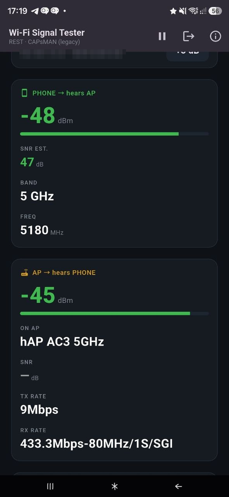
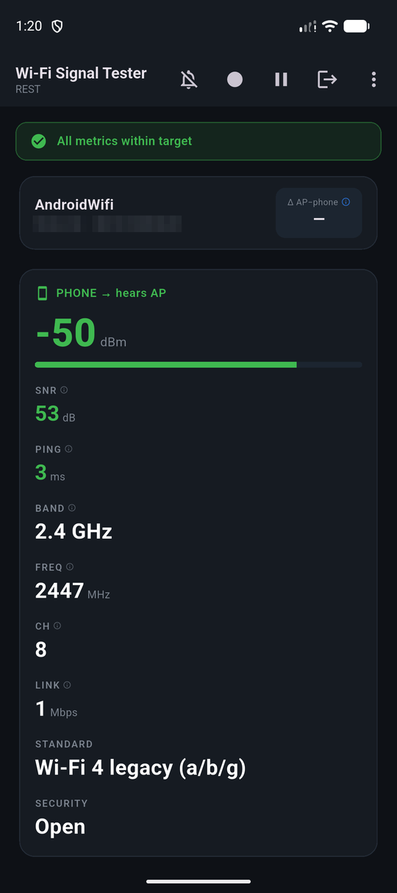
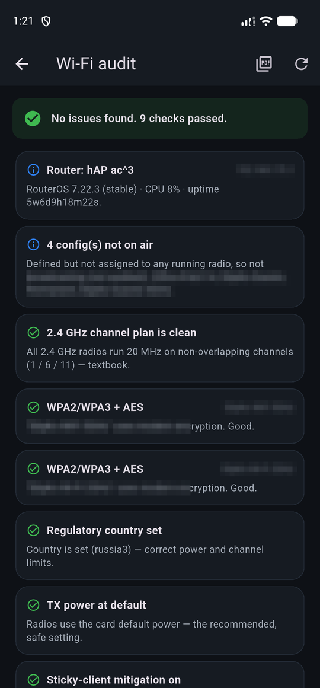
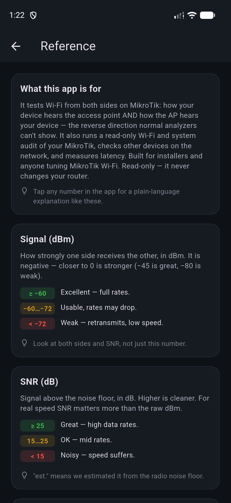

# How to use Wi-Fi Signal Tester

*Русская версия — [usage.ru.md](usage.ru.md)*

This is the user guide: what the app shows, how to read it, and how to run the
typical checks. For the project overview see [README.md](../README.md); for the
version history see [CHANGELOG.md](../CHANGELOG.md).

## Contents

1. [What the app is for](#1-what-the-app-is-for)
2. [What you need before you start](#2-what-you-need-before-you-start)
3. [Preparing the MikroTik](#3-preparing-the-mikrotik)
4. [First launch and permissions](#4-first-launch-and-permissions)
5. [Connecting](#5-connecting)
6. [Reading the dashboard](#6-reading-the-dashboard)
7. [What good numbers look like](#7-what-good-numbers-look-like)
8. [Typical jobs](#8-typical-jobs)
9. [Audits](#9-audits)
10. [History and recording](#10-history-and-recording)
11. [Targets and alerts](#11-targets-and-alerts)
12. [Settings](#12-settings)
13. [Reference and help](#13-reference-and-help)
14. [LTE signal diagnostics](#14-lte-signal-diagnostics)
15. [Support report](#15-support-report)
16. [Troubleshooting](#16-troubleshooting)
17. [What the app never does](#17-what-the-app-never-does)

---

## 1. What the app is for

Every phone Wi-Fi analyzer shows one half of the link: **how your phone hears the
access point**. That half is not enough. A phone can show a comfortable −50 dBm
while the AP hears the phone at −75 dBm — the AP shouts, the phone whispers, and
the connection stutters in one direction only.

This app reads the **other half** from the MikroTik itself (CAPsMAN or plain
Wi-Fi), for **your device's MAC only**, and puts both halves side by side with
the difference between them:



## 2. What you need before you start

- An Android phone with the APK from the
  [Releases page](../../../releases/latest).
- A MikroTik running CAPsMAN or serving Wi-Fi itself, reachable from that phone.
- A **read-only** RouterOS user (see the next section).
- The phone connected to the Wi-Fi you want to test (not mobile data) — the app
  identifies your station by its IP on the router.

Nothing needs to be installed on the router, and nothing about its configuration
has to change beyond enabling the service you connect through.

## 3. Preparing the MikroTik

Full walkthrough: [mikrotik-readonly-user.md](mikrotik-readonly-user.md). Short
version — a group without `write`, plus the service you prefer:

```
/user group add name=monitor policy=read,api,rest-api,ssh,test
/user add name=monitor group=monitor password=CHANGE_ME

/ip service enable www-ssl     # REST  (RouterOS 7.1+)
/ip service enable api         # binary API (RouterOS 6 & 7)
                               # SSH is usually already on
```

Three transports are supported and you can just leave the app on **Auto**:

| Transport | Port | Needs | Notes |
|-----------|------|-------|-------|
| REST | 443 | RouterOS 7.1+, `www-ssl` | Fastest, tried first |
| Binary API | 8728 / 8729 | `api` / `api-ssl` service | Works on RouterOS 6 |
| SSH | 22 | `ssh` policy on the user | Nothing extra to enable; runs only `print` and `monitor once` |

SSH is the rescue path for a router where REST doesn't exist and the API service
is switched off. It is a bit slower (a console command per read — about 120 ms
per poll against 60 ms over REST), and it stays read-only: the app builds every
command itself from a menu path plus `print`/`monitor once`, and refuses
anything else.

## 4. First launch and permissions

The app asks for **location** once. That is not tracking: Android only reveals
the SSID, BSSID and RSSI of the current network to apps holding a location
permission. Deny it and you will still see IP, gateway and the router side, but
the network name and the AP identity stay hidden.

The app does not request background location and never reads physical
coordinates. It also deliberately rejects every permission that could change
Wi-Fi or network settings, so it cannot connect, disconnect or forget networks.

## 5. Connecting

Fill in the form on the first screen:

- **Host / IP** — the router's address, e.g. `192.168.88.1`.
- **Username / Password** — the read-only user.
- **Transport** — `Auto (REST → API → SSH)` unless you have a reason.
- **Port** — leave empty for the standard port; the field is enabled only when
  you pin a transport (a custom port belongs to one protocol).
- **TLS** — on for HTTPS/api-ssl. Self-signed certificates are accepted, which is
  the norm on a LAN.

**Several routers.** Press *Add another router* to build a list — a central
CAPsMAN box plus standalone APs, for example. The app polls all of them and
follows your phone as it roams between them; the dashboard shows which AP
currently serves you. Credentials go into the Android Keystore, never into plain
preferences.

**No router at hand?** Tap *Just view my network (no router)* for phone-only
mode: everything the phone knows about the link (RSSI, band, channel, standard,
security, link speeds, ping) plus a phone-side audit. The AP card is hidden
because there is nothing to read it from.



## 6. Reading the dashboard

**Status strip** (top). Green — every metric is inside your targets. Amber — it
lists exactly what is out of target (phone signal, AP signal, either SNR,
asymmetry).

**Connection summary.** SSID, band, channel and frequency, the AP that serves
you, your IP and BSSID, the transport in use, and the **Δ badge**.

> The Δ badge is the point of the app: the difference between how the AP hears
> you and how you hear the AP. **Tap it** for a plain-language verdict and
> advice — e.g. "the AP is louder than your phone: lower AP TX power or move
> closer", which is the usual fix for a one-sided link.

**Phone → hears AP** (green card). RSSI, SNR, link speeds (tx/rx), 802.11
generation, security, channel.

**AP → hears phone** (blue card). The registration-table numbers for your MAC:
signal, SNR (measured, or estimated from the radio's noise floor where the table
doesn't report it — marked as an estimate), tx/rx rate, CCQ, per-chain signal,
throughput derived from byte counters, uptime on this AP, and a roam counter for
the session.

**Router health.** Board, RouterOS version, CPU load, uptime.

**Ping.** Real ICMP round-trip to the gateway each poll. Latency spikes or loss
while the signal looks strong point at interference or a busy AP.

**Connection diagnosis.** This is a bounded six-sample check, not an endless
rolling verdict. Press *Run diagnosis* to start it at the current position. The
card shows progress, then freezes the result with the AP name and completion
time; tap the verdict for facts, likely causes and checks. After connecting or
roaming the app can run the same check automatically, but waits for the link to
settle first so handoff transients do not distort the result. While waiting,
*Run now* skips the delay; an active run can be cancelled or repeated.

**Sparkline.** Both sides over time — walk around the flat or office and watch
where it collapses.

Any number can be **tapped** for an explanation of what it means and what to do
about it.

## 7. What good numbers look like

| Metric | Good | Usable | Poor |
|--------|------|--------|------|
| Signal (either side) | −30…−60 dBm | −60…−70 dBm | below −75 dBm |
| SNR | above 25 dB | 15…25 dB | below 15 dB |
| Asymmetry Δ | under 6 dB | 6…12 dB | over 12 dB |
| Ping to gateway | under 20 ms | 20…80 ms | over 80 ms, or loss |

A large Δ with a *strong* phone signal is the classic "AP too loud" case: the
phone hears a distant AP fine and keeps clinging to it, but its own transmit
never arrives. Lowering AP TX power or adding an access-list signal range fixes
more problems than raising power ever does.

## 8. Typical jobs

**Walk-around survey.** Connect, press ⏺ *Record*, walk the route slowly, stop
at the dead spots for a few seconds, press ⏹ to stop. The session lands in
*History* and can be exported as CSV.

**Diagnose a one-sided link.** Stand where the complaint is, look at Δ, tap it,
follow the advice. Re-check after the change — the same spot, the same poll
interval.

**Check a TV, laptop or a guest's phone.** ⋮ → *Devices*: every station
currently associated, enriched with IP and name from the DHCP leases. Pick one to
see how the APs hear *it*. Useful for devices that cannot run an analyzer.

**Before/after a config change.** Run the Wi-Fi audit, apply the fixes yourself
on the router, run the audit again, export both to PDF.

## 9. Audits

Three read-only reports, all from ⋮:

- **Wi-Fi audit** — RF and Wi-Fi configuration: channel plan (1/6/11), co-channel
  overlap between your own APs, width on 2.4 GHz, country/regulatory, TX power,
  security of the configurations that are actually applied to a running radio,
  client isolation, sticky-client policy.
- **System audit** — health and hardening: NTP sync, RouterOS update available,
  FTP/Telnet, management services exposed, the default `admin` account, an input
  firewall, IP-pool exhaustion.
- **Network audit (phone)** — in phone-only mode: signal, band, 2.4 GHz channel,
  security, 802.11 generation, and link rate against the signal.



Each finding is bilingual, carries a severity, says *where* it applies and *what
to do*. **Checks that pass are shown too** — a report that lists only problems
never tells you what is already right. Tap *Export PDF* to share a report.

The audit is deliberately conservative and says so when it is unsure:

- it judges the **operating state** (`current-channel`) rather than a config
  field, because CAPsMAN overrides local settings;
- a CAPsMAN configuration that isn't applied to a running radio is not treated as
  a live risk;
- a service is only called "exposed" when there is neither an address ACL nor a
  default-deny firewall rule;
- a disabled `admin` account is reported as **OK**, not as a finding;
- if a menu could not be read, the report says **"Report incomplete: N menu(s)
  unreadable"** and skips the checks that depend on it — an unreadable firewall
  must never be mistaken for a missing firewall.

## 10. History and recording

⏺ in the app bar records every poll into an on-device SQLite database. ⋮ →
*History* lists sessions; open one for the samples, share it as CSV, or delete
it. Deleting removes only the app's own data.

## 11. Targets and alerts

*Settings → Targets* sets the minimum acceptable signal and SNR and the maximum
tolerable asymmetry. The status strip is judged against these numbers.

The bell icon in the app bar toggles **alerts**: on a breach the app beeps
(880 Hz) and vibrates, so you can walk with the phone in your hand and listen
instead of watching. Everything is generated in memory — no media files, no
notification permission.

## 12. Settings

| Setting | Meaning |
|---------|---------|
| Language | Russian / English, switches immediately |
| Poll interval | How often both sides are read (default ~2 s) |
| History length | How many points the sparkline keeps |
| Connection diagnosis | Automatic run after connect/roam and its settling delay (default 10 s); manual run remains available |
| Targets | Minimum signal, minimum SNR, maximum Δ |
| Alerts | Beep + vibrate on a breach, and the Δ threshold |

## 13. Reference and help

⋮ → *Reference* explains every metric the app shows — signal, SNR, CCQ, rates,
throughput, ping, Δ, bands, uptime — in plain language, including what to do when
a number is bad. Tapping a number anywhere in the app opens the same entry.



The book icon in the Reference app bar (and ⋮ → *How to use*) opens this guide.
About → *GitHub* opens the project page.

Two entries worth reading up front: **Δ / asymmetry**, and **Wi-Fi scan
throttling** — Android limits how often apps may scan, which is why some numbers
refresh more slowly than the poll interval.

## 14. LTE signal diagnostics

⋮ → *LTE diagnostics* opens a completely separate tool for a MikroTik with an
LTE modem. It does not use the phone's Wi-Fi measurements and does not require
the phone to be associated with the MikroTik's Wi-Fi. The router only needs to
be reachable over one supported management transport.

Enter the host, read-only username and password. *Auto* tries REST → binary API
→ SSH, or you can pin one transport, its TLS mode and a custom port. Leave *LTE
interface* empty to auto-select a running interface, or enter a name such as
`lte1`. The profile is stored in the device Keystore separately from Wi-Fi
router profiles. Existing profiles created by the SSH-only version remain SSH
profiles after the update.

The app runs only these read-only commands:

```
/interface lte print
/interface lte monitor <interface> once
/system resource print
```

The dashboard refreshes every three seconds and shows:

- **RSRP** — received LTE reference-signal power; the main coverage/antenna
  level;
- **RSRQ** — reference-signal quality, affected by interference and sector load;
- **SINR** — useful signal versus interference/noise; strongly affects speed;
- **RSSI/CQI** where the modem reports them;
- band, channel width, EARFCN, PCI, eNodeB/sector and Cell ID;
- min/average/max values over the latest 60 samples.

Above the technical charts, **LTE Quality 0–100** provides one simpler line:
higher is better. It combines RSRP, RSRQ, SINR and optional CQI, gives received
power more weight when coverage is weak, and penalises unstable readings. The
line is smoothed over five recent samples; a known band/cell handoff is marked
and starts a fresh window instead of mixing two radios. The card shows the
current and best stable result. Tap a point for its underlying radio values or
expand the technical charts. The zones are 0–39 poor, 40–59 attention, 60–79
good and 80–100 excellent.

This score compares **radio conditions**, not Internet speed. Sector load,
routing and provider congestion can still make a high-scoring link slow.

The verdict deliberately separates **weak but clean** coverage (alignment,
height, cable/connectors are likely limiting) from **strong enough but noisy**
radio (interference, reflections or sector load are more likely). Tap RSRP,
RSRQ, SINR, RSSI or CQI for thresholds and an explanation.

### Antenna alignment assistant

On the LTE dashboard, press *Start antenna alignment assistant*. Choose a small
physical movement that you can repeat consistently — for example, one mark on
the bracket. The app cannot know the antenna's absolute azimuth or elevation,
so its X/Y coordinates mean operator-confirmed **steps**, not degrees.

1. Keep the dish still and capture the baseline.
2. Follow the proposed relative move, then press *I moved — measure*.
3. The app waits four seconds for the radio to settle and records six fresh
   readings. Do not move the dish during this window.
4. Repeat the suggested probes. The assistant continues in an improving
   direction, then checks the unvisited neighbours around the confirmed best
   checkpoint.
5. When no neighbouring checkpoint is meaningfully better, return by the shown
   number of steps, halve the physical step and start the fine pass.

The same Quality Score line is used here and on the dashboard; expand the
technical block to keep RSRP, RSRQ and SINR visible separately. The checkpoint
score is only a navigation aid: when RSRP is very weak it gives coverage more
weight; once power is usable it prioritises SINR/RSRQ, includes CQI where
available and penalises unstable peaks. Always verify the raw metrics.
A band or serving-cell handoff is marked because a score change may then come
from the handoff rather than antenna movement alone.

The checkpoints remain available if you leave and reopen the assistant, but
the current alignment grid is cleared when you disconnect from the LTE router.
Use the restart icon to discard it and take a new baseline.

### LTE recording history

Tap the red record icon on the LTE dashboard to start a persistent session.
Every successful LTE poll is then stored locally; tap Stop or disconnect to
finish it. Open *LTE history* from the dashboard menu to rename, inspect,
export or delete a session. Select exactly two sessions to compare their
RSRP/RSRQ/SINR/RSSI/CQI averages, spreads, bands and serving cells.
The comparison also includes the average LTE Quality Score and P10: the score
that 90% of stable measurements were no worse than.

At 1× each live or saved chart fits its whole series into the available width.
Use −/+, the 1×…20× slider or a two-finger pinch to expand it, then pan
horizontally. This does not discard points; it only changes their display scale.
Saved history contains only app-created radio measurements and can be deleted
from the history screen.

RouterOS often includes IMEI, IMSI and ICCID in the monitor response. The app
does not model, display, log or persist those identifiers; they are discarded
immediately after the response is parsed.

## 15. Support report

⋮ → *Support report* creates troubleshooting material you can send to the
developer. Nothing is collected remotely and nothing is uploaded automatically.
Only pressing *Create and share ZIP* writes a temporary archive containing:

- `report.txt` — readable app/device state, current two-sided metrics and link
  diagnosis;
- `report.json` — the same facts in a structured form;
- `events.log` — up to 200 controlled connection/lifecycle events kept only in
  memory until the app restarts or you clear them;
- `README.txt` — a privacy reminder.

SSID, BSSID, MAC, IP and router/AP names are masked by default. You may include
them with the switch when they are necessary to reproduce a problem. Passwords,
tokens, private keys, raw RouterOS responses and full lists of other clients are
never included, even with that switch enabled. Review `report.txt` before
sharing. *Copy readable report* is available when a ZIP is inconvenient.

## 16. Troubleshooting

| Symptom | Cause and fix |
|---------|---------------|
| "Not connected to Wi-Fi" while you are | Location permission denied, or the phone is on mobile data. Grant location; the app also judges by IP, so check you have a LAN address. |
| AP card empty, "not on a MikroTik-managed AP" | Your phone associated with an AP this router doesn't manage. Add that router too (*Add another router*). |
| Authentication failed | Wrong user/password, or the group lacks the policy for that transport (`rest-api`, `api`, `ssh`). |
| "REST API not available" | RouterOS 6, or `www-ssl` disabled. Switch the transport to Auto, API or SSH. |
| Router unreachable | Wrong host, or you're not on its network. Check the gateway shown in the summary. |
| Values refresh slowly | Android Wi-Fi scan throttling — see the Reference entry, or raise the poll interval. |
| SNR marked as estimate | The registration table doesn't report SNR (typical for CAPsMAN); it is derived from the radio's measured noise floor. |
| Nothing at all over SSH | The user's group needs the `ssh` policy; check `/ip service` allows your subnet. LTE can also use REST or the binary API. |
| LTE says no interface was found | Check that `/interface lte print` contains an enabled interface, or clear/correct the optional interface name in the LTE form. |
| LTE is registered but metrics are empty | Wait for the modem to finish registering; some modem/RouterOS combinations need a current modem firmware before they expose radio metrics. |
| Audit says "Report incomplete" | Those menus couldn't be read — usually a session dropped while the app was in the background (it reconnects, so just re-run), or a user without rights to them. |

## 17. What the app never does

- **On the router:** no writes, ever. There is no write path in the code — the
  transport interface exposes only reads, and the SSH transport additionally
  whitelists `print` / `monitor once` and refuses anything else. It reads only
  what it needs: ARP/DHCP for IP→MAC, the registration table for your MAC,
  wireless and system menus for the audit, or the LTE interface/monitor in the
  separate LTE tool. LTE modem/SIM identifiers returned by RouterOS are
  discarded rather than stored.
- **On the phone:** it reads the Wi-Fi chip but never changes, connects,
  disconnects or forgets a network — the permission to do so is explicitly
  removed from the manifest. It accesses no contacts or media. The only data it
  stores is its own: router credentials in the Keystore, settings, measurement
  history, and a temporary support ZIP created only on request — and only app
  data can be deleted from inside the app.

Questions, bugs and ideas: [GitHub issues](../../../issues), or Telegram
[@slipko](https://t.me/slipko).
